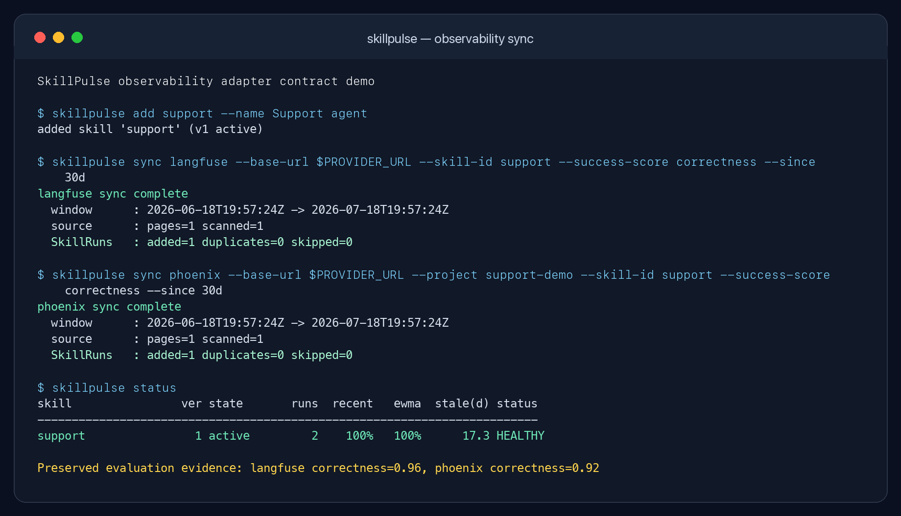

<p align="center">
  
</p>

<h3 align="center">Runtime health monitoring and safe lifecycle management for Agent Skills</h3>

<p align="center">
  Detect degradation from real executions, attribute the root cause, and validate externally-authored candidates before promotion.
</p>

<p align="center">
  <a href="https://github.com/HarryFunn/skillpulse/actions/workflows/ci.yml"></a>
  <a href="LICENSE"></a>
  
  
</p>

<p align="center">
  <strong>English</strong> | <a href="README_ZH.md">简体中文</a>
</p>

---

SkillPulse evaluates each Agent Skill version from its real execution history. Outcomes can be recorded directly or synchronized from Langfuse and Phoenix. SkillPulse detects statistically significant degradation, distinguishes environment drift from model changes, task drift, and intrinsic defects, then manages a gated **detect → attribute → submit candidate → offline replay → canary → promote/rollback** workflow.

Unlike tools that rely only on upstream versions, Git commits, or file hashes, SkillPulse measures whether a Skill still works in practice.

## Why it's different

- **Degradation from outcomes, not metadata.** A two-proportion z-test compares
  a skill's recent success rate against its own long-run baseline, catching
  silent breakage that version-diff tools miss.
- **Root-cause attribution.** Detecting *that* a skill broke isn't enough to
  know *what to do*. SkillPulse attributes each degradation to one of four
  causes — environment drift, model change, task drift, or an intrinsic skill
  defect — and maps each to a different recommended action.
- **Candidates are gated in stages.** SkillPulse first replays history, then
  admits passing candidates to a canary trial. Failed candidates never replace
  the incumbent.
- **Full audit trail.** Every state change is logged, so you can explain why any
  version was flagged, submitted, promoted, or retired.
- **Bring your existing observability data.** Langfuse traces/scores and Phoenix
  root spans/annotations become idempotent `SkillRun` records instead of another
  disconnected telemetry silo.
- **Zero dependencies.** Pure standard library + SQLite. Works as a library or a
  CLI.

## Install

```bash
pip install -e .          # from the repo root
```

## Quick start (CLI)

```bash
# register a Skill; v1 becomes active
skillpulse add scraper --name "Scrape page title" --content-file skill.txt

# record the final outcome of complete Skill executions
skillpulse run-record scraper --ok --run-id run-001
skillpulse run-record scraper --fail --run-id run-002 \
  --error "SelectorNotFound" --model claude-sonnet --tag web-scraping

skillpulse status
skillpulse doctor
skillpulse attribute scraper

# submit a candidate; it cannot receive live traffic yet
skillpulse repair scraper --content-file candidate-skill.txt

# replay-results.json maps historical run_id -> candidate outcome
skillpulse replay scraper 2 --results replay-results.json

# only a replay-approved candidate enters probation
skillpulse evaluate scraper      # -> promoted | rejected | pending

# export a machine-readable report
skillpulse report --output report.json
```

## Pull outcomes from Langfuse or Phoenix

The integration layer reads the final/root operation of each trace, joins its
trace-level and root-operation evaluation evidence, maps it to a registered
Skill version, and stores one idempotent `SkillRun`. Child spans remain in the
observability platform: a
successful child operation is not automatically treated as a successful Skill.

<p align="center">
  
</p>

The screenshot comes from `python -m demo.integrations`, an offline contract
demo that exercises the real HTTP clients, mapping, CLI, and SQLite store against
local API fixtures. It requires no provider account and sends no external data.

Register the Skill first, then choose either a CLI fallback mapping or namespaced
metadata on each root trace.

### Langfuse

SkillPulse uses the current
[Observations API v2](https://langfuse.com/docs/api-and-data-platform/features/observations-api)
and [Scores API v3](https://langfuse.com/changelog/2026-06-10-scores-v3-api).
Set project API credentials with environment variables; secrets are never CLI
arguments.

```bash
export LANGFUSE_PUBLIC_KEY=pk-lf-...
export LANGFUSE_SECRET_KEY=sk-lf-...
# Optional for self-hosted or another cloud region:
export LANGFUSE_BASE_URL=https://cloud.langfuse.com

skillpulse --db skills.db sync langfuse \
  --skill-id support-answer \
  --success-score correctness \
  --success-threshold 0.8 \
  --since 24h
```

### Phoenix

SkillPulse uses Phoenix's current project
[root-span](https://arize.com/docs/phoenix/sdk-api-reference/rest-api/api-reference/spans/list-spans-with-simple-filters-no-dsl)
plus [trace](https://arize.com/docs/phoenix/sdk-api-reference/rest-api/api-reference/annotations/get-trace-annotations-for-a-list-of-trace_ids)
and [root-span annotations](https://arize.com/docs/phoenix/sdk-api-reference/rest-api/api-reference/annotations/get-span-annotations-for-a-list-of-span_ids)
REST APIs. A bearer token is optional when authentication is disabled on a
self-hosted instance.

```bash
export PHOENIX_BASE_URL=http://localhost:6006
export PHOENIX_API_KEY=...

skillpulse --db skills.db sync phoenix \
  --project support-production \
  --skill-id support-answer \
  --success-score correctness \
  --success-threshold 0.8 \
  --since 24h
```

### Mapping rules

CLI options are useful when one provider project represents one Skill. For
multi-Skill projects, omit `--skill-id`/`--version` and add the namespaced fields
to the Langfuse root observation metadata or Phoenix root span attributes.

| SkillRun field | Resolution order |
| --- | --- |
| `skill_id` | `--skill-id`, then `skillpulse.skill_id` (required; unknown Skills are skipped) |
| `version` | `--version`, `skillpulse.version`, then the registered active version |
| `success` | named `--success-score`, `skillpulse.success`, then provider root error status |
| `task_tag` | `skillpulse.task_tag`, then the trace/root-span name |
| `model`, input, output, session | normalized from provider root fields/attributes |

A configured `--success-score` is strict: a trace without that score is skipped
instead of silently falling back to span status. Boolean/categorical scores use
pass/fail labels; numeric scores use `--success-threshold`. Imported metadata and
all fetched evaluation evidence are preserved on the `SkillRun` for auditing.
When the same evaluation name exists at both levels, the most recently updated
value wins.

Synchronization is cursor-paginated and checkpointed in the same SQLite file.
The checkpoint advances only after a complete polling window succeeds. Later
runs overlap the saved watermark by 10 minutes, then rely on stable provider IDs
for deduplication; this catches delayed telemetry without creating duplicate
runs. The first run defaults to a 24-hour lookback. Use `--since 7d`, an ISO-8601
timestamp, or epoch seconds to override it; use `--no-checkpoint` for a one-off
read.

The provider-neutral Python API is available under `skillpulse.integrations`:

```python
from skillpulse.integrations import (
    LangfuseSource, MappingConfig, RunMapper, RunSynchronizer,
)

result = RunSynchronizer(
    store,
    RunMapper(MappingConfig(
        skill_id="support-answer",
        success_score="correctness",
        success_threshold=0.8,
    )),
).sync(LangfuseSource(), since=None)
```

## Quick start (library)

```python
from skillpulse import LifecycleManager, SkillRun, SkillStore

store = SkillStore("skills.db")
manager = LifecycleManager(store)
store.add_skill("scraper", "Scrape page title", content="selector = 'head > title'")
manager.activate_initial("scraper")

store.record_skill_run(SkillRun(
    run_id="run-001",
    skill_id="scraper",
    version=1,
    success=True,
    input_data={"url": "https://example.test"},
))

if manager.scan():
    candidate = manager.repair(
        "scraper",
        repair_fn=lambda old, reasons: generate_candidate(old, reasons),
    )
    replay = manager.replay(
        "scraper", candidate.version,
        replay_fn=lambda candidate_content, historical_run: replay_in_sandbox(
            candidate_content, historical_run.input_data),
    )
    if replay.passed:
        version = manager.route("scraper")  # canary is now eligible
```

## How degradation is detected

A skill version is flagged **DEGRADED** when any of these fire:

1. **Recent-vs-baseline drop** — a one-sided two-proportion z-test on the recent
   window's success rate vs the long-run baseline exceeds `z_threshold`
   (default 1.645 ≈ 95% confidence). Catches sudden environment breakage.
2. **EWMA below floor** — the exponentially weighted success rate falls under
   `ewma_floor`. Catches gradual decay.
3. **Staleness** — no executions for `stale_after_days`. Reported as a warning;
   flags DEGRADED only if `stale_is_degraded` is set.

All thresholds live in `HealthConfig`; probation behavior in `ProbationConfig`.

## Root-cause attribution

Once a skill is flagged, `Attributor` classifies *why* it degraded from
interpretable signals in the execution stream (change-point sharpness, dominant
error signature, model shift, task out-of-distribution) and recommends an
action:

- **Environment drift** — sudden break, one dominant error, same model & tasks
  → **repair** the skill to the new environment.
- **Model change** — failures concentrated on a model unseen while healthy
  → **re-verify**; the fix is likely prompt/model adaptation, not skill logic.
- **Task drift** — failures on task types never seen when healthy
  → **narrow scope**; the skill is being used out-of-distribution, not broken.
- **Skill defect** — flaky throughout with no external explanation
  → **rewrite** rather than patch.

Attribution needs the optional `model` and `task_tag` fields on execution
records (`skillpulse record ... --model <m> --tag <t>`). Thresholds live in
`AttributionConfig`.

## Two-level candidate gate

```
active ──degradation──► degraded ──external submission──► candidate
                                                │
                                   offline replay gate
                                   ├── fail ──► candidate
                                   └── pass ──► probation
                                                    │
                                      live canary evaluation
                                      ├── pass ──► active (old -> retired)
                                      └── fail ──► rejected
```

Offline replay measures both `fix_rate` on historical failures and
`regression_rate` on historical successes. A candidate must satisfy both
thresholds before it can receive live canary traffic.

## Try the demo

```bash
python -m demo.simulate
```

Simulates a scraper skill that breaks when the target site changes its HTML:
SkillPulse detects and attributes the drop, accepts an externally-authored
candidate, gates it through offline replay and live canary evaluation, and
promotes it once proven — printing the full audit trail.

## ToolCall vs SkillRun

SkillPulse deliberately separates two levels of evidence:

- `ToolCall`: one tool invocation inside an agent session.
- `SkillRun`: the final outcome of a complete Skill execution, which may contain
  multiple tool calls.

Claude Code and Codex transcripts expose tool calls, so `ingest` stores
`ToolCall` records only. It does not equate a successful tool call with a
successful Skill and does not auto-register tool names as Skills.

```bash
skillpulse ingest ~/.claude/projects --format claude
skillpulse ingest ~/.codex/sessions --format codex
```

Import is idempotent. Stable IDs derived from the transcript path and original
call ID prevent repeated imports from duplicating data. The CLI reports
`added`, `duplicates`, `skipped`, and `files` counts. Calls with no matching
result are skipped as incomplete.

Record the final Skill outcome separately with `run-record` or the Python
`record_skill_run()` API. Imported calls can be attached with repeatable
`--tool-call-id <stable-id>` arguments. Health detection, attribution, replay,
and probation then use SkillRun outcomes rather than raw tool-call success.

The Langfuse and Phoenix adapters follow the same boundary. They create one
`SkillRun` from a trace root and its final evaluation evidence; they do not
promote arbitrary child span names to Skills or convert child status into the
final outcome.

## Run the tests

```bash
pip install -e ".[dev]"
pytest
```

## License

MIT
