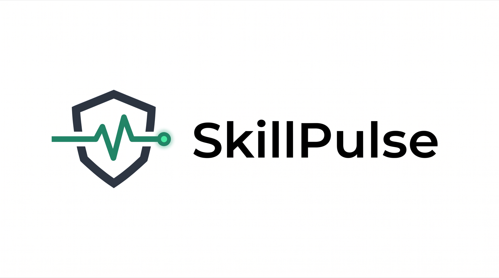

<p align="center">
  
</p>

<h3 align="center">面向 Agent Skill 的运行监测与安全生命周期管理</h3>

<p align="center">
  基于真实执行结果检测退化、分析原因，并在修复版本晋升前完成灰度验证。
</p>

<p align="center">
  <a href="https://github.com/HarryFunn/skillpulse/actions/workflows/ci.yml"></a>
  <a href="LICENSE"></a>
  
  
</p>

<p align="center">
  <a href="README.md">English</a> | <strong>简体中文</strong>
</p>

---

SkillPulse 根据真实执行记录持续评估每个 Agent Skill 版本的运行表现，通过统计方法识别显著退化，区分环境变化、模型切换、任务分布变化和 Skill 自身缺陷，并管理一套完整的 **检测 → 归因 → 修复 → 灰度验证 → 晋升/回滚** 流程。

与仅依赖上游版本、Git 提交或文件哈希的工具不同，SkillPulse 关注的是 Skill 在实际运行中是否仍然有效。

## 核心能力

- **基于真实执行结果检测退化**：使用双样本比例 z 检验，对比 Skill 的近期成功率与历史基线，识别仅靠版本号、Git 提交或文件哈希无法发现的运行质量下降。
- **分析退化原因**：根据成功率变化、错误类型、模型信息和任务标签，将问题归因于环境变化、模型切换、任务分布变化或 Skill 自身缺陷，并给出相应的处理建议。
- **灰度验证修复版本**：修复后的版本先进入 probation 状态，只承接一定比例的调用；达到最小试验次数和成功率要求后才会晋升，否则自动拒绝该版本。
- **支持安全回滚**：新版本验证失败时保留原有现役版本，避免未经验证的修改影响全部调用。
- **完整记录生命周期**：Skill 的创建、退化标记、修复、晋升、拒绝和退役等操作都会写入审计日志。
- **轻量且无运行时依赖**：基于 Python 标准库和 SQLite 实现，可作为 Python 库使用，也可通过命令行操作。

## 安装

在仓库根目录执行：

```bash
pip install -e .
```

如需运行测试：

```bash
pip install -e ".[dev]"
```

## CLI 快速开始

```bash
# 注册 Skill，v1 自动成为现役版本
skillpulse add scraper --name "抓取页面标题" --content-file skill.txt

# 记录完整 Skill 执行的最终结果
skillpulse run-record scraper --ok --run-id run-001
skillpulse run-record scraper --fail --run-id run-002 \
  --error "SelectorNotFound" --model claude-sonnet --tag web-scraping

skillpulse status
skillpulse doctor
skillpulse attribute scraper

# repair 只创建 candidate，此时不能承接线上流量
skillpulse repair scraper --content-file fixed_skill.txt

# replay-results.json 的格式为 {"历史 run_id": true/false}
skillpulse replay scraper 2 --results replay-results.json

# 离线回放通过后，candidate 才会进入 probation
skillpulse evaluate scraper      # promoted | rejected | pending

# 输出机器可读的完整报告
skillpulse report --output report.json
```

## 作为 Python 库使用

```python
from skillpulse import LifecycleManager, SkillRun, SkillStore

store = SkillStore("skills.db")
manager = LifecycleManager(store)
store.add_skill("scraper", "抓取页面标题", content="selector = 'head > title'")
manager.activate_initial("scraper")

store.record_skill_run(SkillRun(
    run_id="run-001",
    skill_id="scraper",
    version=1,
    success=True,
    input_data={"url": "https://example.test"},
))

if manager.scan():
    candidate = manager.repair(
        "scraper", repair_fn=lambda old, reasons: fix(old, reasons))
    replay = manager.replay(
        "scraper", candidate.version,
        replay_fn=lambda candidate_content, historical_run: replay_in_sandbox(
            candidate_content, historical_run.input_data),
    )
    if replay.passed:
        version = manager.route("scraper")  # candidate 此时才有资格承接灰度流量
```

## 退化检测机制

SkillPulse 综合使用以下三类信号评估 Skill 版本的运行状态。

### 1. 近期成功率显著下降

将近期窗口的成功率与长期历史基线进行单侧双样本比例 z 检验。当统计量超过 `z_threshold` 时，判定近期表现出现显著下降。

默认阈值为 `1.645`，对应约 95% 的单侧置信水平。这类信号适合识别 API、页面结构或外部服务突然变化造成的集中失败。

### 2. EWMA 成功率低于下限

使用指数加权移动平均（EWMA）提高近期执行结果的权重。当 EWMA 低于 `ewma_floor` 时，将 Skill 标记为退化。

该指标用于识别缓慢发生的质量下降，也能发现长期表现不稳定的 Skill。

### 3. 长期未验证

如果某个版本超过 `stale_after_days` 没有执行，SkillPulse 会将其报告为长期未验证。默认情况下，该信号只产生提示；将 `stale_is_degraded` 设为 `True` 后，也可直接将其视为退化。

检测参数通过 `HealthConfig` 配置，灰度验证参数通过 `ProbationConfig` 配置。

## 退化原因分析

检测到退化后，`Attributor` 会结合执行记录中的可解释信号判断原因，包括成功率变化幅度、主要错误类型、模型变化和任务分布变化。

### 环境变化（`environment_drift`）

典型特征：成功率突然下降、失败集中于同一种错误，同时模型与任务类型保持不变。

建议：检查 API、网页结构、数据格式或外部依赖是否发生变化，并据此修复 Skill。

### 模型切换（`model_change`）

典型特征：失败主要发生在历史健康阶段未使用过的新模型上。

建议：优先重新验证提示词、工具调用格式和模型兼容性，而不是直接修改 Skill 的业务逻辑。

### 任务分布变化（`task_drift`）

典型特征：失败主要来自历史健康阶段没有覆盖过的新任务类型。

建议：调整 Skill 的描述或触发条件，限制适用范围；必要时为新任务创建独立 Skill。

### Skill 自身缺陷（`skill_defect`）

典型特征：不存在清晰的突发变化，Skill 在较长时间内持续出现不同类型的失败，也无法由模型或任务变化解释。

建议：重新设计或重写 Skill，而不是继续叠加局部补丁。

为了提高归因质量，建议在记录执行结果时提供 `model` 和 `task_tag`：

```bash
skillpulse record scraper \
  --fail \
  --error "SelectorNotFound" \
  --model claude-sonnet \
  --tag web-scraping
```

归因阈值通过 `AttributionConfig` 配置。

## 两级修复验证

```text
active ──检测到退化──► degraded ──repair──► candidate
                                             │
                                       离线历史回放
                                       ├── 未通过 ──► candidate
                                       └── 通过 ──► probation
                                                      │
                                                线上灰度验证
                                                ├── 通过 ──► active（旧版本 retired）
                                                └── 未通过 ──► rejected
```

离线回放同时计算两个指标：历史失败样本的 `fix_rate`，以及历史成功样本的
`regression_rate`。只有两项均达到阈值，candidate 才能进入 probation 并承接线上灰度流量。

各状态含义：

- `candidate`：新建但尚未验证的版本。
- `probation`：正在接受灰度验证的版本。
- `active`：当前现役版本。
- `degraded`：已检测到运行质量下降的版本。
- `retired`：已被新版本替换的历史版本。
- `rejected`：未通过灰度验证的版本。

## 运行演示

```bash
python -m demo.simulate
```

演示脚本模拟如下流程：

1. 页面标题抓取 Skill 在初始阶段保持正常。
2. 目标网站调整 HTML 结构，旧选择器开始持续失败。
3. SkillPulse 检测到成功率显著下降并归因为环境变化。
4. 修复版本以 candidate 状态创建，暂不承接线上流量。
5. 回放历史成功/失败样本，验证修复率和回归率。
6. 回放通过后进入 probation，并接受线上灰度验证。
7. 达到成功率要求后晋升，旧版本转为退役状态。
8. 输出完整的生命周期审计记录。

## ToolCall 与 SkillRun

SkillPulse 明确区分两层执行数据：

- `ToolCall`：Agent 会话中的单次工具调用。
- `SkillRun`：一次完整 Skill 执行的最终结果，其中可以包含多个 ToolCall。

Claude Code 和 Codex 的本地日志主要暴露工具调用，因此 `ingest` 只导入 ToolCall。
它不会把一次工具调用成功等同于整个 Skill 成功，也不会把工具名自动注册为 Skill。

```bash
skillpulse ingest ~/.claude/projects --format claude
skillpulse ingest ~/.codex/sessions --format codex
```

导入过程支持幂等执行。SkillPulse 根据会话文件路径和原始 call ID 生成稳定标识，
重复导入同一日志不会产生重复数据。CLI 会分别报告 `added`、`duplicates`、
`skipped` 和 `files`。没有匹配结果的调用会作为不完整记录跳过。

完整 Skill 的最终结果应通过 `run-record` 或 Python API `record_skill_run()` 单独记录。
通过可重复使用的 `--tool-call-id <稳定标识>` 参数，可以把已导入的 ToolCall 关联到该
SkillRun。退化检测、原因归因、离线回放和 probation 评估均使用 SkillRun，而不是原始工具调用结果。

## 运行测试

```bash
pytest
```

当前测试覆盖：

- Skill 和版本的创建、激活与存储。
- z 检验、EWMA 与长期未验证检测。
- 退化标记与审计记录。
- ToolCall 与 SkillRun 的分层存储及幂等写入。
- 离线回放的修复率、回归率和 probation 准入门。
- 修复版本的灰度路由、晋升和拒绝。
- 环境变化、模型切换、任务分布变化和 Skill 缺陷归因。
- Claude Code 与 Codex 日志解析、重复导入和统计结果。
- JSON 报告 schema 与旧数据库自动迁移。

## 许可证

本项目采用 [MIT License](LICENSE)。
