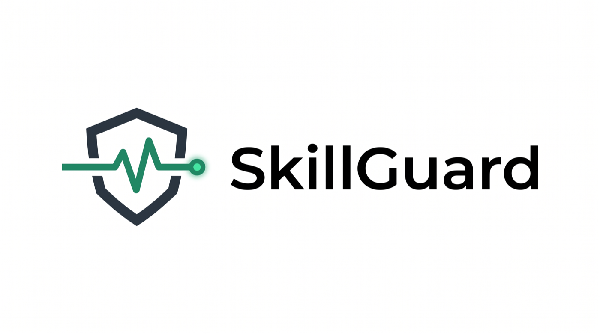

<p align="center">
  
</p>

<h3 align="center">面向 Agent Skill 的运行监测与安全生命周期管理</h3>

<p align="center">
  基于真实执行结果检测退化、分析原因，并在修复版本晋升前完成灰度验证。
</p>

<p align="center">
  <a href="https://github.com/HarryFunn/skillguard/actions/workflows/ci.yml"></a>
  <a href="LICENSE"></a>
  
  
</p>

<p align="center">
  <a href="README.md">English</a> | <strong>简体中文</strong>
</p>

---

SkillGuard 根据真实执行记录持续评估每个 Agent Skill 版本的运行表现，通过统计方法识别显著退化，区分环境变化、模型切换、任务分布变化和 Skill 自身缺陷，并管理一套完整的 **检测 → 归因 → 修复 → 灰度验证 → 晋升/回滚** 流程。

与仅依赖上游版本、Git 提交或文件哈希的工具不同，SkillGuard 关注的是 Skill 在实际运行中是否仍然有效。

## 核心能力

- **基于真实执行结果检测退化**：使用双样本比例 z 检验，对比 Skill 的近期成功率与历史基线，识别仅靠版本号、Git 提交或文件哈希无法发现的运行质量下降。
- **分析退化原因**：根据成功率变化、错误类型、模型信息和任务标签，将问题归因于环境变化、模型切换、任务分布变化或 Skill 自身缺陷，并给出相应的处理建议。
- **灰度验证修复版本**：修复后的版本先进入 probation 状态，只承接一定比例的调用；达到最小试验次数和成功率要求后才会晋升，否则自动拒绝该版本。
- **支持安全回滚**：新版本验证失败时保留原有现役版本，避免未经验证的修改影响全部调用。
- **完整记录生命周期**：Skill 的创建、退化标记、修复、晋升、拒绝和退役等操作都会写入审计日志。
- **轻量且无运行时依赖**：基于 Python 标准库和 SQLite 实现，可作为 Python 库使用，也可通过命令行操作。

## 安装

在仓库根目录执行：

```bash
pip install -e .
```

如需运行测试：

```bash
pip install -e ".[dev]"
```

## CLI 快速开始

```bash
# 注册 Skill，首个版本会自动激活
skillguard add scraper \
  --name "抓取页面标题" \
  --content-file skill.txt

# 记录执行结果
skillguard record scraper --ok
skillguard record scraper --fail --error "SelectorNotFound"

# 查看技能库整体运行状态
skillguard status

# 检测退化并标记异常版本
skillguard doctor

# 分析退化原因并获取处理建议
skillguard attribute scraper

# 创建修复版本，并进入灰度验证阶段
skillguard repair scraper --content-file fixed_skill.txt

# 根据灰度执行结果决定晋升、拒绝或继续观察
skillguard evaluate scraper

# 查看版本关系和审计记录
skillguard history scraper
```

`evaluate` 可能返回：

- `promoted`：修复版本通过验证并晋升为现役版本。
- `rejected`：修复版本未达到要求，已被拒绝。
- `pending`：有效试验次数不足，暂不作出决定。

## 作为 Python 库使用

```python
from skillguard import ExecutionRecord, LifecycleManager, SkillStore

store = SkillStore("skills.db")
manager = LifecycleManager(store)

store.add_skill(
    "scraper",
    "抓取页面标题",
    content="selector = 'head > title'",
)
manager.activate_initial("scraper")

# Agent 调用 Skill 后记录执行结果
store.record_execution(
    ExecutionRecord("scraper", version=1, success=True)
)

# 定期检查现役版本是否出现退化
flagged = manager.scan()

# 接入人工修复或 LLM 修复逻辑
if flagged:
    manager.repair(
        "scraper",
        repair_fn=lambda old_content, reasons: fix(old_content, reasons),
    )

# 根据配置将少量调用路由到灰度版本
version = manager.route("scraper")

# 试验次数达到要求后评估灰度版本
manager.evaluate_probation("scraper")
```

## 退化检测机制

SkillGuard 综合使用以下三类信号评估 Skill 版本的运行状态。

### 1. 近期成功率显著下降

将近期窗口的成功率与长期历史基线进行单侧双样本比例 z 检验。当统计量超过 `z_threshold` 时，判定近期表现出现显著下降。

默认阈值为 `1.645`，对应约 95% 的单侧置信水平。这类信号适合识别 API、页面结构或外部服务突然变化造成的集中失败。

### 2. EWMA 成功率低于下限

使用指数加权移动平均（EWMA）提高近期执行结果的权重。当 EWMA 低于 `ewma_floor` 时，将 Skill 标记为退化。

该指标用于识别缓慢发生的质量下降，也能发现长期表现不稳定的 Skill。

### 3. 长期未验证

如果某个版本超过 `stale_after_days` 没有执行，SkillGuard 会将其报告为长期未验证。默认情况下，该信号只产生提示；将 `stale_is_degraded` 设为 `True` 后，也可直接将其视为退化。

检测参数通过 `HealthConfig` 配置，灰度验证参数通过 `ProbationConfig` 配置。

## 退化原因分析

检测到退化后，`Attributor` 会结合执行记录中的可解释信号判断原因，包括成功率变化幅度、主要错误类型、模型变化和任务分布变化。

### 环境变化（`environment_drift`）

典型特征：成功率突然下降、失败集中于同一种错误，同时模型与任务类型保持不变。

建议：检查 API、网页结构、数据格式或外部依赖是否发生变化，并据此修复 Skill。

### 模型切换（`model_change`）

典型特征：失败主要发生在历史健康阶段未使用过的新模型上。

建议：优先重新验证提示词、工具调用格式和模型兼容性，而不是直接修改 Skill 的业务逻辑。

### 任务分布变化（`task_drift`）

典型特征：失败主要来自历史健康阶段没有覆盖过的新任务类型。

建议：调整 Skill 的描述或触发条件，限制适用范围；必要时为新任务创建独立 Skill。

### Skill 自身缺陷（`skill_defect`）

典型特征：不存在清晰的突发变化，Skill 在较长时间内持续出现不同类型的失败，也无法由模型或任务变化解释。

建议：重新设计或重写 Skill，而不是继续叠加局部补丁。

为了提高归因质量，建议在记录执行结果时提供 `model` 和 `task_tag`：

```bash
skillguard record scraper \
  --fail \
  --error "SelectorNotFound" \
  --model claude-sonnet \
  --tag web-scraping
```

归因阈值通过 `AttributionConfig` 配置。

## 生命周期

```text
candidate ──激活/晋升──► active ──检测到退化──► degraded
    ▲                       │                         │
    │                       │ repair()                │ repair()
    └────── probation ◄─────┴─────────────────────────┘
               │
               ├── 验证通过 ──► active（原版本转为 retired）
               └── 验证失败 ──► rejected（现役版本保持不变）
```

各状态含义：

- `candidate`：新建但尚未验证的版本。
- `probation`：正在接受灰度验证的版本。
- `active`：当前现役版本。
- `degraded`：已检测到运行质量下降的版本。
- `retired`：已被新版本替换的历史版本。
- `rejected`：未通过灰度验证的版本。

## 运行演示

```bash
python -m demo.simulate
```

演示脚本模拟如下流程：

1. 页面标题抓取 Skill 在初始阶段保持正常。
2. 目标网站调整 HTML 结构，旧选择器开始持续失败。
3. SkillGuard 检测到成功率显著下降。
4. 归因模块将问题识别为环境变化。
5. 修复版本进入灰度验证阶段。
6. 修复版本达到成功率要求后晋升，旧版本转为退役状态。
7. 输出完整的生命周期审计记录。

## 导入真实会话记录

SkillGuard 可以从本地 Agent 会话日志中提取工具调用及其执行结果，无需手工逐条录入。

```bash
# 导入 Claude Code 会话记录
skillguard ingest ~/.claude/projects --format claude

# 导入 Codex rollout 记录
skillguard ingest ~/.codex/sessions --format codex

# 分析导入后的真实执行数据
skillguard status
skillguard doctor
skillguard attribute <skill_id>
```

### 结果判定规则

- Claude Code：`tool_result` 中 `is_error: true` 的调用记为失败。
- Codex：工具输出中的 `exit_code` 非零或包含 `error` 字段时记为失败。
- 没有对应结果的调用视为不完整记录，不会写入数据库。
- 会话中的模型信息和工作目录会分别写入 `model` 与 `task_tag`，供归因模块使用。

默认情况下，导入器会自动注册未出现过的工具名称。使用 `--no-register` 可以跳过尚未注册的工具：

```bash
skillguard ingest ~/.claude/projects \
  --format claude \
  --no-register
```

## 运行测试

```bash
pytest
```

当前测试覆盖：

- Skill 和版本的创建、激活与存储。
- z 检验、EWMA 与长期未验证检测。
- 退化标记与审计记录。
- 修复版本的灰度路由、晋升和拒绝。
- 环境变化、模型切换、任务分布变化和 Skill 缺陷归因。
- Claude Code 与 Codex 会话日志解析和导入。

## 许可证

本项目采用 [MIT License](LICENSE)。
